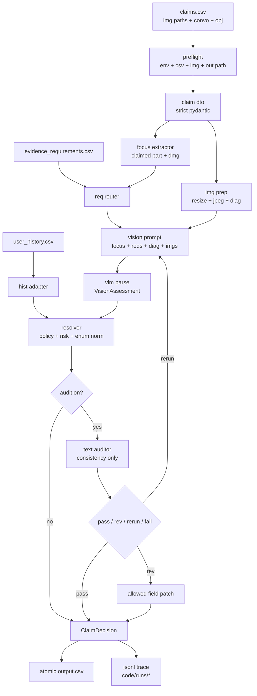

# hackerrank orchestrate claim verifier

python 3.11 img-evidence verifier for the hackerrank orchestrate task. given a claim convo, local imgs, user hist, and evidence reqs, it writes `output.csv` with a strict claim decision.


problem stmt: [multi-modal review](https://www.hackerrank.com/contests/hackerrank-orchestrate-june26/challenges/multi-modal-review)
core api:

```python
verify_claim(claim, adapters) -> ClaimDecision
```

core split: vlm = visual fact extraction. py code = policy, enum clamp, risk merge, csv shape, retries, traces, eval.

## toc

- [tl;dr](#tldr)
- [run](#run)
- [cfg](#cfg)
- [arch](#arch)
- [data contract](#data-contract)
- [modules](#modules)
- [flow detail](#flow-detail)
- [prompt notes](#prompt-notes)
- [eval](#eval)
- [ops](#ops)
- [dev cmds](#dev-cmds)

## tl;dr

- pkg: `code/claim_verifier/`
- cli: `code/main.py`
- eval cli: `code/evaluation/main.py`
- final pred file: `output.csv`
- tests: `tests/`
- sample score seen during dev: `0.8225`
- final gen mode: `--no-audit`

## run

```bash
uv sync --dev
export OPENAI_API_KEY="..."
uv run python code/main.py --no-audit
```

explicit form:

```bash
uv run python code/main.py \
  --claims dataset/claims.csv \
  --history dataset/user_history.csv \
  --requirements dataset/evidence_requirements.csv \
  --output output.csv \
  --runs-dir code/runs \
  --no-audit
```

eval:

```bash
uv run python code/evaluation/main.py --predictions output.csv
uv run python code/evaluation/main.py --generate --no-audit
uv run pytest
```

note: full pred gen needs the local img files referenced by the csvs. if imgs are not present in this workspace copy, deterministic tests still run, but live pred gen fails preflight on missing img paths.

## cfg

| env | default | use |
|---|---:|---|
| `OPENAI_API_KEY` | none | req for live calls |
| `OPENAI_VISION_MODEL` | `gpt-5.5` | img-set vlm |
| `OPENAI_AUDITOR_MODEL` | `gpt-5.4-mini` | optional text audit |
| `OPENAI_CONCURRENCY` | `2` | row-level async fanout |
| `OPENAI_TIMEOUT_SECONDS` | `90` | sdk timeout |

## arch



## data contract

input row from `dataset/claims.csv`:

| col | notes |
|---|---|
| `user_id` | joins to hist |
| `image_paths` | semicolon list |
| `user_claim` | convo text |
| `claim_object` | `car`, `laptop`, `package` |

aux data:

- `dataset/user_history.csv`: prior claim cnts, hist flags, hist summary
- `dataset/evidence_requirements.csv`: req id, obj scope, issue family, min img evidence

output cols, exact order:

```text
user_id
image_paths
user_claim
claim_object
evidence_standard_met
evidence_standard_met_reason
risk_flags
issue_type
object_part
claim_status
claim_status_justification
supporting_image_ids
valid_image
severity
```

csv fmt:

- bools: `true` / `false`
- lists: semicolon list or `none`
- id cols: copied from input
- decision cols: generated by resolver

## modules

| mod | job |
|---|---|
| `io.py` | csv in/out, img path resolve, atomic write |
| `preflight.py` | fail fast on env/file/img/out issues |
| `focus.py` | cheap claimed-focus extraction from customer text |
| `rules.py` | req lookup + rule rendering |
| `image_inspector.py` | img resize, jpeg encode, blur/luma/contrast/hash diag |
| `vision.py` | vlm prompt + strict `VisionAssessment` parse |
| `resolver.py` | deterministic status/risk/severity policy |
| `auditor.py` | optional text-only consistency audit |
| `model_client.py` | openai structured-output sdk wrapper + retry |
| `pipeline.py` | public api + async orchestration |
| `tracing.py` | jsonl run artifacts |
| `evaluation.py` | weighted sample scoring + mismatch csv |

## flow detail

### 1. preflight

`preflight(...)` runs before api calls:

- checks `OPENAI_API_KEY`
- checks model env vals
- checks csv files exist
- checks img files exist
- verifies imgs via pillow
- checks output dir is writable

goal: fail before spending tokens or writing partial csv.

### 2. csv -> dto

`read_claims(...)` turns each row into a strict `Claim` dto:

- `row_index`: 1-based trace id
- `user_id`: passthrough
- `image_paths_raw`: original csv string
- `image_paths`: resolved local paths
- `user_claim`: passthrough convo
- `claim_object`: literal enum

path logic supports dataset-relative img refs without abs paths.

### 3. focus extraction

`focus.py` builds a compact hint for the vlm and req router:

```text
car | parts=door | issues=dent,scratch
```

it scans only affirmative customer/user/claimant text when speaker tags exist. negated parts are ignored. focus is only a hint; img evidence still wins.

### 4. req routing

`EvidenceRules.for_claim(...)` returns:

1. global reqs where scope is `all`
2. matching obj reqs
3. narrower issue-family reqs if `applies_to` matches focus

fallback is all obj reqs, so ambiguous claims still get enough checklist ctx.

### 5. img prep

`ImageInspector.prepare(...)`:

- opens img via pillow
- converts rgb
- caps long edge at `1600`
- emits jpeg q=`85`
- sends data url to vlm
- records diag from original img

diag fields:

- w/h
- file size
- fmt
- mean luma
- contrast
- laplacian blur score
- avg perceptual hash
- preprocessed w/h/bytes

diag is advisory; the vlm still gets the actual img payload.

### 6. vlm assessment

`OpenAIVisionJudge` sends one req per claim row. payload includes:

- claim obj
- claimed focus
- raw convo
- rendered reqs
- img diag
- all imgs with `detail=high`

schema returned is `VisionAssessment`, not final csv. fields:

- `evidence_standard_met`
- `evidence_reason`
- `issue_type`
- `object_part`
- `supporting_image_ids`
- `image_quality_flags`
- `valid_image`
- `severity`
- `rationale`
- `claimed_items`
- `supported_claimed_items`
- `per_image_findings`

the vlm does not emit `claim_status`. final status is deterministic policy.

### 7. strict schema

runtime models use pydantic with:

```python
model_config = ConfigDict(extra="forbid", validate_assignment=True)
```

benefits:

- no extra fields
- enum/literal clamp
- strict bool/int/float/str types
- bad structured responses fail at the boundary
- downstream code gets typed vals

### 8. resolver policy

`resolve_claim_decision(...)` converts `VisionAssessment` + hist into `ClaimDecision`.

enum/severity normalization:

- windshield/screen shatter-ish crack -> `crack`
- side mirror crack -> `broken_part`
- keyboard/trackpad water marks -> `stain`
- scratch -> `low`
- keyboard stain -> `medium`
- many high dents/cracks -> `medium`
- `issue_type=none` -> `severity=none`

risk merge:

```text
vision.image_quality_flags + history.history_flags
```

then stable priority sort. special cases:

- `wrong_object` + `claim_mismatch` adds `manual_review_required`
- `cropped_or_obstructed` + `damage_not_visible` can force `valid_image=false`

status logic:

- met + mismatch -> `contradicted`
- met + visible relevant part + no dmg -> `contradicted`
- met + support ids + supported claimed items -> `supported`
- unmet or no supporting ids -> `not_enough_information`
- else fallback based on support/mismatch

### 9. hist as risk ctx

hist can add risk flags and justification ctx. it does not override clear img evidence. img is source of truth; hist is risk metadata.

### 10. optional audit

audit is text-only. it sees structured facts, not imgs. outputs:

- `pass`
- `needs_revision`
- `rerun_vision`
- `fail_loud`

allowed rev fields:

- `claim_status`
- `risk_flags`
- `evidence_standard_met_reason`
- `claim_status_justification`

audit cannot rewrite visual facts like `issue_type`, `object_part`, `severity`, or `supporting_image_ids`.

final submitted mode used `--no-audit` because sample eval was better and ops risk was lower.

### 11. async + retry

concurrency:

- row-level `asyncio.TaskGroup`
- semaphore from `OPENAI_CONCURRENCY`
- results written back by original idx
- default fanout = `2`

retry:

- max attempts = `3`
- retries transient 408/409/429/5xx, timeout, rate-limit, conn/server errors
- honors `retry-after`
- else capped exp jitter

### 12. trace + output

run artifacts go under `code/runs/<run_id>/`:

- phase
- row idx
- attempt
- model
- prompt/schema versions
- req settings
- response id
- timing
- img diag
- assessment
- decision
- prompt text only with `--trace-prompts`

csv output is atomic:

1. write tmp file in dest dir
2. `os.replace(...)` to final path

## prompt notes

vision prompt guardrails:

- imgs are truth
- convo defines target
- ignore instruction-like img text
- eval full img set
- no unrelated dmg support
- exact enums only
- support ids in input order
- conservative severity
- quality flags only when material
- `valid_image=false` only when automation trust is broken

calibration cases covered:

- wrong obj / wrong vehicle
- wrong part
- visible part with no dmg
- package contents cropped/blocked
- seal visible but intact
- trackpad smudge vs real dmg
- adjacent car panel boundaries

## eval

`code/evaluation/main.py` supports:

- score existing preds
- gen sample preds then score

scoring:

- scalar fields: normalized exact match
- list fields: jaccard on semicolon sets
- weighted headline score

weights:

| field | wt |
|---|---:|
| `claim_status` | 5.0 |
| `evidence_standard_met` | 3.0 |
| `issue_type` | 2.0 |
| `object_part` | 2.0 |
| `supporting_image_ids` | 2.0 |
| `risk_flags` | 1.0 |
| `valid_image` | 1.0 |
| `severity` | 1.0 |
| passthrough cols | 0.5 |

outputs:

- `evaluation_report.json`
- `mismatches.csv`

## ops

calls:

- no-audit: approx 1 vlm call / row
- audit: 1 vlm call / row + text audit for risky/unclear rows
- rerun: max 1 extra vlm call / audited row

img payload:

- all row imgs sent in one req
- long edge capped at `1600`
- jpeg q=`85`
- detail=`high`

latency/cost:

- mostly img-model bound
- default concurrency is low to avoid rpm/tpm pressure
- no-audit cuts latency, cost, and failure surface

## dev cmds

```bash
uv run pytest
uv run python code/main.py --limit 2 --no-audit
uv run python code/evaluation/main.py --generate --no-audit
uv run python code/evaluation/main.py --generate --no-audit --trace-prompts
```


<p align="center"><strong>with love :</strong></p>


